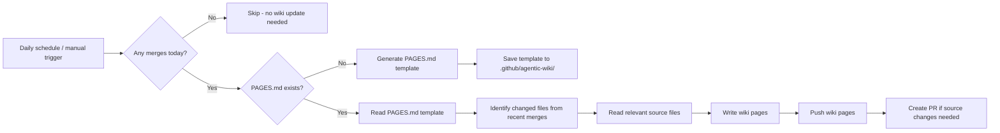

# 📖 Agentic Wiki Writer

> For an overview of all available workflows, see the [main README](../README.md).

**Automatically generates and maintains GitHub wiki pages from your source code**

The [Agentic Wiki Writer workflow](../workflows/agentic-wiki-writer.md?plain=1) keeps your project's GitHub wiki synchronized with the codebase. Once a day (if any pull requests were merged to the default branch), it reads a `PAGES.md` template to understand what to document, then writes wiki pages directly from the source code. You can also trigger it manually on demand.

> [!WARNING]
> **The repository wiki must be initialized before running this workflow.** GitHub does not create the wiki git repository until at least one page exists. Go to your repository's **Wiki** tab and create a blank page (e.g. "Home") to initialize it. The workflow will fail with a git clone error if this step is skipped.

## Installation

```bash
# Install the 'gh aw' extension
gh extension install github/gh-aw

# Add the workflow to your repository
gh aw add-wizard githubnext/agentics/agentic-wiki-writer
```

This walks you through adding the workflow to your repository.

## How It Works



On the first run (or when `regenerate-template` is enabled), the workflow generates a `PAGES.md` template describing the wiki structure it will maintain. On subsequent runs it follows the template — reading only the source files relevant to the recently merged PRs, then writing updated wiki content.

### Key Features

- **Incremental updates**: Uses repo memory to track content hashes and skip unchanged pages
- **Template-driven**: A `PAGES.md` file in `.github/agentic-wiki/` controls what gets documented
- **Paired with Agentic Wiki Coder**: Together they form a bidirectional sync between wiki and source code

## Usage

### First Run

Trigger the workflow manually with `regenerate-template: true` to create the initial `PAGES.md` template. Review and customize the template to match your documentation goals.

### Configuration

The workflow runs once a day (at midnight UTC) and checks whether any pull requests were merged to the default branch in the last 24 hours. If no merges happened, it exits early with no work done. You can also trigger it manually from the Actions tab.

You can adjust the cadence or event structure to suit your team's workflow. For example, to run on every push to the default branch instead of on a schedule, replace the `schedule: daily` trigger with:

```yaml
on:
  push:
    branches: [main]
  workflow_dispatch:
    ...
```

Or to run twice a day, change the schedule to:

```yaml
on:
  schedule:
    - cron: "0 6,18 * * *"
  workflow_dispatch:
    ...
```

After editing the workflow file, run `gh aw compile` to update the compiled workflow and commit all changes to the default branch.

Available inputs for manual dispatch:

- **`regenerate-template`** (`boolean`, default `false`) — Set to `true` to rebuild the `PAGES.md` template from scratch.

## PAGES.md Format

The `PAGES.md` file at `.github/agentic-wiki/PAGES.md` is the single source of truth for your wiki structure. It is generated automatically on the first run and saved as a PR for you to review. After that, you can edit it freely to customize your documentation structure. You can also supply a `PAGES.md` yourself before the first run to pre-define the structure.

### Header Hierarchy

| Level | Purpose | Output |
|-------|---------|--------|
| H1 (`#`) | Top-level page | Separate `.md` file, top-level sidebar entry |
| H2 (`##`) | Nested page | Separate `.md` file, indented under parent in sidebar |
| H3 (`###`) | Deeply nested page | Separate `.md` file, further indented in sidebar |
| H4+ (`####`) | Section within page | H2+ header in rendered page, not in sidebar nav |
| H4+ with `+` (`####+`) | Sidebar section | H2+ header in page, included in sidebar nav |

### Query Templates

Use `*{ query }*` syntax to mark content that should be AI-generated:

```markdown
# Home

*{ Provide an overview of this project }*

## Architecture

*{ Describe the system architecture and key design decisions }*
```

Static text is preserved as-is:

```markdown
# Getting Started

This guide will help you set up the project.

*{ List the installation steps }*

For more help, see the troubleshooting section.
```

### Sidebar Sections

By default, H4+ headers become sections within a page but don't appear in the sidebar. Add `+` after the hashes to include them in sidebar navigation:

```markdown
# API Reference

*{ Overview of the API }*

####+ Authentication
*{ Describe auth flow }*

####+ Rate Limits
*{ Describe rate limiting }*

#### Internal Details
*{ Implementation details - not shown in sidebar }*
```

This generates:
- Sidebar: `API Reference` with nested links to `#Authentication` and `#Rate Limits`
- Page: All three sections rendered as H2 headers

### Header Normalization

Sections (H4–H6) are normalized when rendered to individual pages:

| In PAGES.md | In rendered page |
|-------------|-----------------|
| `####` / `####+` | `##` |
| `#####` | `###` |
| `######` | `####` |

Every page starts with an implicit H1 (the page title, rendered by GitHub from the filename). Sections start at H2.

### Slug Generation

Page and section slugs are generated from titles:
- Spaces → hyphens
- Special characters removed (apostrophes, parentheses, question marks, etc.)
- Multiple hyphens collapsed

| Title | Slug |
|-------|------|
| `Getting Started` | `Getting-Started` |
| `What's New?` | `Whats-New` |
| `API Reference (v2)` | `API-Reference-v2` |

### Complete Example

```markdown
# Home

Welcome to the project documentation.

*{ Provide a brief overview of the project }*

# Architecture

*{ Describe the high-level architecture }*

## Frontend

*{ Describe the frontend stack }*

### Components

*{ List major React components }*

####+ State Management
*{ Explain how state is managed }*

####+ Routing
*{ Describe the routing setup }*

## Backend

*{ Describe the backend architecture }*

### API

*{ Document the REST API }*

####+ Endpoints
*{ List all endpoints }*

# Getting Started

*{ Write a getting started guide }*

#### Prerequisites
*{ List prerequisites }*

#### Installation
*{ Installation steps }*
```

**Output files:**

| File | Content |
|------|---------|
| `Home.md` | H1 title + overview content |
| `Architecture.md` | H1 title + architecture content |
| `Frontend.md` | H1 title + frontend content + State Management (H2) + Routing (H2) sections |
| `Components.md` | H1 title + components content |
| `Backend.md` | H1 title + backend content |
| `API.md` | H1 title + API content + Endpoints (H2) section |
| `Getting-Started.md` | H1 title + guide content + Prerequisites (H2) + Installation (H2) sections |
| `_Sidebar.md` | Auto-generated navigation |

**Generated sidebar:**

```markdown
- [[Home|Home]]
- [[Architecture|Architecture]]
  - [[Frontend|Frontend]]
    - [[State Management|Frontend#State-Management]]
    - [[Routing|Frontend#Routing]]
    - [[Components|Components]]
  - [[Backend|Backend]]
    - [[API|API]]
      - [[Endpoints|API#Endpoints]]
- [[Getting Started|Getting-Started]]
```

## Learn More

- [Agentic Wiki Writer source workflow](https://github.com/githubnext/agentics/blob/main/workflows/agentic-wiki-writer.md)
- [Agentic Wiki Coder](agentic-wiki-coder.md) — the paired reverse workflow
- [GitHub Wikis documentation](https://docs.github.com/en/communities/documenting-your-project-with-wikis)
