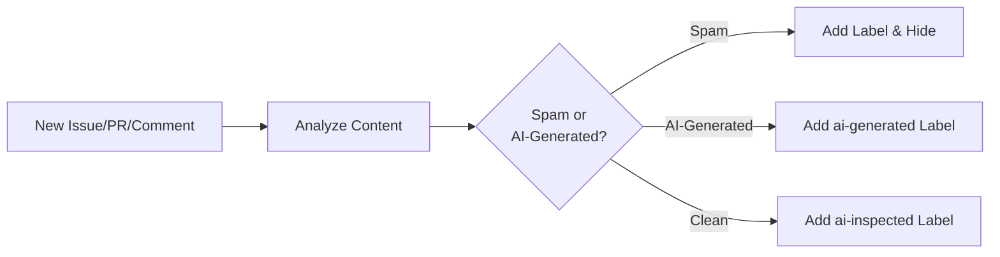

# 🛡️ AI Moderator

> For an overview of all available workflows, see the [main README](../README.md).

**Automatically detect spam, link spam, and AI-generated content in GitHub issues, comments, and pull requests**

The [AI Moderator workflow](../workflows/ai-moderator.md?plain=1) helps maintain quality discussions and protect your repository from malicious or low-quality contributions by automatically moderating incoming content.

## Installation

```bash
# Install the 'gh aw' extension
gh extension install github/gh-aw

# Add the workflow to your repository
gh aw add-wizard githubnext/agentics/ai-moderator
```

This walks you through adding the workflow to your repository.

## How It Works



The workflow reads new issues, comments, and pull request diffs, then applies appropriate labels (`spam`, `link-spam`, `ai-generated`, or `ai-inspected`). It can hide comments detected as spam. Requires `issues: write` and `pull-requests: write` permissions for full functionality.

## Usage

This workflow triggers automatically when issues, comments, or pull requests are created—you cannot start it manually.

### Configuration

The workflow works out of the box with sensible defaults. You can customize:

- Labels to apply for different detection types
- User roles that are skipped (defaults to admins, maintainers, write access, and triage)
- Bots to skip (defaults to github-actions and copilot)
- Rate limiting settings
- Detection criteria and thresholds

After editing run `gh aw compile` to update the workflow and commit all changes to the default branch.

### Human in the Loop

- Review labels applied to ensure accurate spam detection
- Monitor for false positives and adjust detection criteria if needed
- Override moderation decisions when the AI makes mistakes
- Unhide legitimate content if necessary
