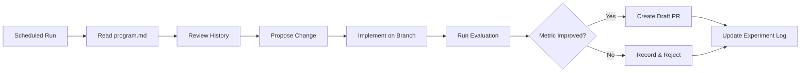
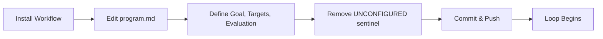

# Autoloop

> For an overview of all available workflows, see the [main README](../README.md).

**Iterative optimization agent inspired by [Autoresearch](https://github.com/karpathy/autoresearch) and Claude Code's `/loop`**

The [Autoloop workflow](../workflows/autoloop.md?plain=1) runs on a schedule to autonomously improve a target artifact toward a measurable goal. Each iteration proposes a change, evaluates it against a metric, and keeps only improvements.

## Installation

```bash
# Install the 'gh aw' extension
gh extension install github/gh-aw

# Add the workflow to your repository
gh aw add-wizard githubnext/agentics/autoloop
```

This walks you through adding the workflow to your repository.

## How It Works



## Getting Started

When you install Autoloop, a **template `program.md`** is added to your repo at `.github/autoloop/program.md`. This template has placeholder sections you must fill in — the workflow **will not run** until you do.

### Setup flow



1. **Install** — `gh aw add-wizard githubnext/agentics/autoloop`
2. **Edit** — Open `.github/autoloop/program.md` and replace the placeholders with your project's goal, target files, and evaluation command. The template includes three complete examples (ML training, test coverage, build performance) for inspiration.
3. **Activate** — Remove the `<!-- AUTOLOOP:UNCONFIGURED -->` line at the top of the file.
4. **Compile & push** — `gh aw compile && git add . && git commit -m "Configure autoloop" && git push`

If you forget to edit the template, the first scheduled run will create a GitHub issue reminding you, with a direct link to edit the file.

## Configuration

The `program.md` file (at `.github/autoloop/program.md` or repo root) has three sections:

### 1. Goal — What to optimize

Describe the objective in natural language. Be specific about what "better" means.

### 2. Target — What files can be changed

List the files the agent is allowed to modify. Everything else is off-limits.

### 3. Evaluation — How to measure success

Provide a command to run and a metric to extract. Specify whether higher or lower is better.

### Example program.md

````markdown
# Autoloop Program

## Goal

Optimize the training script to minimize validation loss on CIFAR-10
within a 5-minute training budget.

## Target

Only modify these files:
- `train.py`
- `config.yaml`

## Evaluation

```bash
python train.py --epochs 5 && python evaluate.py --output-json results.json
```

Metric: `validation_loss` from `results.json`. Lower is better.
````

### Customizing the Schedule

Edit the workflow's `schedule` field. Examples:
- `every 6h` — 4 times a day (default)
- `every 1h` — hourly iterations
- `daily` — once a day
- `0 */2 * * *` — every 2 hours (cron syntax)

After editing, run `gh aw compile` to update the workflow.

## Usage

### Automatic mode

Once `program.md` exists and the workflow is installed, iterations run automatically on schedule. Each run:

1. Reads the program definition and past history
2. Proposes a single targeted change
3. Runs the evaluation command
4. Accepts (creates draft PR) or rejects (logs the attempt)

### Manual trigger

```bash
# Run an iteration now
gh aw run autoloop

# Give specific instructions
gh aw run autoloop -- "try using cosine annealing for the learning rate schedule"
```

### Slash command

Comment on any issue or PR:
```
/autoloop try batch size 64 instead of 32
```

## Experiment Tracking

All iterations are logged in a monthly GitHub issue titled `[Autoloop] Experiment Log {YYYY-MM}`. The issue tracks:

- Current best metric value
- Full iteration history with accept/reject status
- Links to PRs for accepted changes
- Links to GitHub Actions runs

## Human in the Loop

- **Review draft PRs** — accepted improvements appear as draft PRs for human review
- **Merge or close** — you decide which optimizations to keep
- **Adjust the program** — update `program.md` to change the goal, targets, or evaluation
- **Steer via slash command** — use `/autoloop <instructions>` to direct specific experiments
- **Pause** — disable the workflow schedule to stop iterations

## Security

- Runs with read-only GitHub permissions
- Only modifies files listed in `program.md`'s Target section
- Never modifies evaluation scripts
- All changes go through draft PRs requiring human approval
- Uses "safe outputs" to constrain what the agent can create
