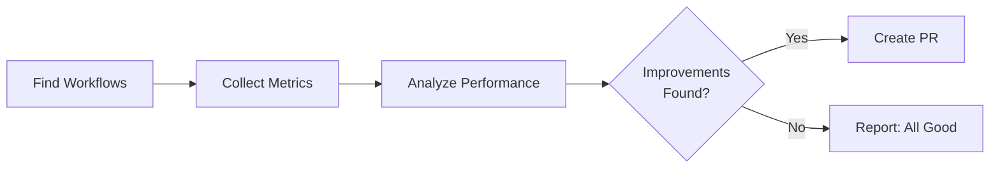

# 🚀 CI Coach

> For an overview of all available workflows, see the [main README](../README.md).

**Automated CI/CD optimization expert that analyzes your GitHub Actions workflows and proposes efficiency improvements**

The [CI Coach workflow](../workflows/ci-coach.md?plain=1) is your personal CI/CD optimization consultant. It runs daily to analyze workflows, collect performance metrics, identify optimization opportunities, and propose concrete improvements through pull requests.

## Installation

```bash
# Install the 'gh aw' extension
gh extension install github/gh-aw

# Add the workflow to your repository
gh aw add-wizard githubnext/agentics/ci-coach
```

This walks you through adding the workflow to your repository.

## How It Works



The workflow analyzes job parallelization, caching strategy, test distribution, resource allocation, artifact management, and conditional execution. All suggestions are backed by actual workflow run data and performance metrics.

### Quality Standards

- ✅ Minimal, focused changes
- ✅ Low-risk optimizations prioritized
- ✅ Clear documentation
- ❌ Never breaks test integrity
- ❌ Never sacrifices correctness for speed

## Examples

From Peli's Agent Factory:
> "CI Optimization Coach has contributed **9 merged PRs out of 9 proposed (100% merge rate)**, optimizing CI pipelines for speed and efficiency with perfect execution."

- [Removing unnecessary test dependencies](https://github.com/github/gh-aw/pull/13925)
- [Fixing duplicate test execution](https://github.com/github/gh-aw/pull/8176)

## Usage

### Configuration

The workflow works out of the box. You can customize the schedule, timeout, and PR expiration in the workflow file.

After editing run `gh aw compile` to update the workflow and commit all changes to the default branch.

### Triggering CI on Pull Requests

To automatically trigger CI checks on PRs created by this workflow, configure an additional repository secret `GH_AW_CI_TRIGGER_TOKEN`. See the [triggering CI documentation](https://github.github.com/gh-aw/reference/triggering-ci/) for setup instructions.

## Learn More

- [CI Coach source workflow](https://github.com/github/gh-aw/blob/main/.github/workflows/ci-coach.md)
- [GitHub Actions best practices](https://docs.github.com/en/actions/security-guides/security-hardening-for-github-actions)
- [Optimizing GitHub Actions workflows](https://docs.github.com/en/actions/using-workflows/caching-dependencies-to-speed-up-workflows)
