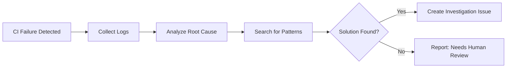

# 🏥 CI Doctor

> For an overview of all available workflows, see the [main README](../README.md).

**Automated CI failure investigator that analyzes root causes and provides actionable recommendations**

The [CI Doctor workflow](../workflows/ci-doctor.md?plain=1) monitors your GitHub Actions workflows and automatically investigates CI failures. When a monitored workflow fails, it conducts deep analysis to identify root causes, patterns, and provides recommendations for fixing issues.

## Installation

```bash
# Install the 'gh aw' extension
gh extension install github/gh-aw

# Add the workflow to your repository
gh aw add-wizard githubnext/agentics/ci-doctor
```

This walks you through adding the workflow to your repository.

## How It Works



The workflow collects failed workflow logs, analyzes root causes, searches for patterns in historical issues, and creates detailed investigation issues with recommendations.

## Usage

### Configuration

You can specify which workflows to monitor by editing the workflow directly.

After editing run `gh aw compile` to update the workflow and commit all changes to the default branch.
