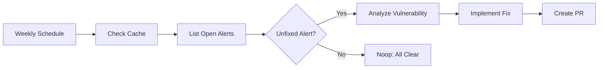

# 🔐 Code Scanning Fixer

> For an overview of all available workflows, see the [main README](../README.md).

**Automatically fix GitHub code scanning (CodeQL) security alerts by analyzing vulnerabilities and creating pull requests with remediation**

The [Code Scanning Fixer workflow](../workflows/code-scanning-fixer.md?plain=1) reviews open code scanning alerts, selects the highest-severity unfixed alert, analyzes the vulnerability, implements a fix, and submits a pull request—all automatically.

## Installation

```bash
# Install the 'gh aw' extension
gh extension install github/gh-aw

# Add the workflow to your repository
gh aw add-wizard githubnext/agentics/code-scanning-fixer
```

This walks you through adding the workflow to your repository.

## How It Works



The workflow selects one alert per run, from highest severity down (critical → high → medium → low), and uses cache memory to track which alerts have already been addressed so it never duplicates work.

## Prerequisites

This workflow requires GitHub code scanning (e.g., CodeQL) to be enabled on your repository. Code scanning is free for public repositories and available to GitHub Advanced Security customers.

- [Enable code scanning with CodeQL](https://docs.github.com/en/code-security/code-scanning/enabling-code-scanning/configuring-default-setup-for-code-scanning)

## Usage

### Configuration

The workflow uses these defaults:

| Setting | Default | Description |
|---------|---------|-------------|
| Schedule | Weekly | When to look for alerts to fix |
| PR Labels | `security`, `automated-fix` | Labels applied to fix PRs |
| PR Expiry | 2 days | PRs auto-close if not merged |
| Reviewers | `copilot` | Default PR reviewer |
| Timeout | 20 minutes | Per-run time limit |

After editing run `gh aw compile` to update the workflow and commit all changes to the default branch.

### Triggering CI on Pull Requests

To automatically trigger CI checks on PRs created by this workflow, configure an additional repository secret `GH_AW_CI_TRIGGER_TOKEN`. See the [triggering CI documentation](https://github.github.com/gh-aw/reference/triggering-ci/) for setup instructions.

## Learn More

- [Daily Malicious Code Scan](daily-malicious-code-scan.md) — Scans recent commits for suspicious patterns
- [GitHub Code Scanning Documentation](https://docs.github.com/en/code-security/code-scanning/introduction-to-code-scanning/about-code-scanning)
- [GitHub Agentic Workflows Documentation](https://github.github.io/gh-aw/)
