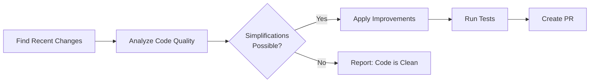

# 🧹 Code Simplifier

> For an overview of all available workflows, see the [main README](../README.md).

**Automatically analyze recently modified code and create pull requests with simplifications that improve clarity and maintainability**

The [Code Simplifier workflow](../workflows/code-simplifier.md?plain=1) runs daily to review code modified in the last 24 hours and apply targeted improvements that enhance clarity, reduce complexity, and follow project conventions—all while preserving functionality.

## Installation

```bash
# Install the 'gh aw' extension
gh extension install github/gh-aw

# Add the workflow to your repository
gh aw add-wizard githubnext/agentics/code-simplifier
```

This walks you through adding the workflow to your repository.

## How It Works



Common improvements include reducing nested conditionals, extracting repeated logic, improving naming, consolidating error handling, and applying idiomatic language features.

## Examples

From the gh-aw repository (83% merge rate):

- [Extract action mode helper to reduce duplication](https://github.com/github/gh-aw/pull/13982)
- [Simplify validation config code for clarity](https://github.com/github/gh-aw/pull/13118)

## Usage

### Configuration

The workflow uses these defaults:
- **Schedule**: Runs daily
- **Scope**: Code changed in the last 24 hours
- **PR Labels**: `refactoring`, `code-quality`, `automation`
- **Expires**: PRs auto-close after 1 day if not merged

After editing run `gh aw compile` to update the workflow and commit all changes to the default branch.

### Triggering CI on Pull Requests

To automatically trigger CI checks on PRs created by this workflow, configure an additional repository secret `GH_AW_CI_TRIGGER_TOKEN`. See the [triggering CI documentation](https://github.github.com/gh-aw/reference/triggering-ci/) for setup instructions.

## Learn More

- [Update Docs](update-docs.md) - Maintains documentation automatically
- [Daily Test Coverage Improver](daily-test-improver.md) - Improves test coverage
- [Daily Performance Improver](daily-perf-improver.md) - Optimizes code performance
