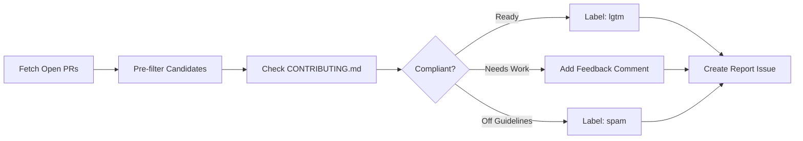

# 🔍 Contribution Check

> For an overview of all available workflows, see the [main README](../README.md).

**Batch review of open pull requests against repository contribution guidelines**

The [Contribution Check workflow](../workflows/contribution-check.md?plain=1) runs every 4 hours to review open pull requests against your CONTRIBUTING.md. It helps maintainers efficiently prioritize community contributions by categorizing PRs as ready to review, needing work, or outside contribution guidelines.

## Installation

```bash
# Install the 'gh aw' extension
gh extension install github/gh-aw

# Add the workflow to your repository
gh aw add-wizard githubnext/agentics/contribution-check
```

This walks you through adding the workflow to your repository.

## How It Works



The workflow creates report issues with PRs grouped by readiness level (🟢 Ready, 🟡 Needs work, 🔴 Off-guidelines), adds comments with constructive feedback, and applies labels based on quality signals.

## Usage

### Configuration

You can customize the target repository (via `TARGET_REPOSITORY` variable, requires additional authorization), schedule frequency, and report format. The workflow requires a `CONTRIBUTING.md` file to evaluate PRs against.

After editing run `gh aw compile` to update the workflow and commit all changes to the default branch.

### Human in the Loop

- Review report issues to prioritize maintainer review time
- Validate PRs marked as `lgtm` are ready for code review
- Check PRs flagged as `spam` before taking action
- Engage with contributors who receive feedback
