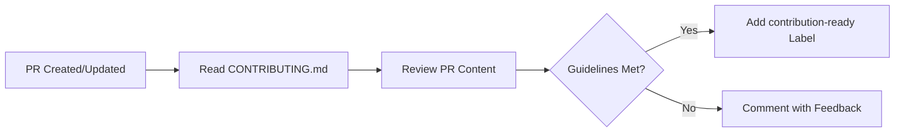

# ✅ Contribution Guidelines Checker

> For an overview of all available workflows, see the [main README](../README.md).

**Verify incoming pull requests comply with repository contribution guidelines**

The [Contribution Guidelines Checker workflow](../workflows/contribution-guidelines-checker.md?plain=1) reviews incoming PRs against your CONTRIBUTING.md and similar documentation, then either labels the PR as ready or provides constructive feedback on what needs improvement.

## Installation

```bash
# Install the 'gh aw' extension
gh extension install github/gh-aw

# Add the workflow to your repository
gh aw add-wizard githubnext/agentics/contribution-guidelines-checker
```

This walks you through adding the workflow to your repository.

## How It Works



The workflow automatically runs on pull requests.

## Usage

### Configuration

This workflow requires no configuration and works out of the box. It automatically reviews contribution guidelines documents and checks PRs against them.

After editing run `gh aw compile` to update the workflow and commit all changes to the default branch.

### Human in the Loop

- Review feedback provided by the workflow for accuracy
- Follow up on PRs that need improvements
- Update contribution guidelines based on common patterns
- Manually apply labels if the workflow's assessment needs adjustment
