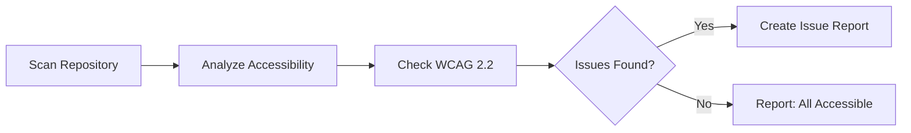

# 🔍 Daily Accessibility Review

> For an overview of all available workflows, see the [main README](../README.md).

**Perform accessibility reviews checking for WCAG 2.2 compliance and documenting problems found**

The [Daily Accessibility Review workflow](../workflows/daily-accessibility-review.md?plain=1) scans your repository, analyzes accessibility against WCAG 2.2 guidelines, and creates issues documenting any accessibility problems found.

## Installation

```bash
# Install the 'gh aw' extension
gh extension install github/gh-aw

# Add the workflow to your repository
gh aw add-wizard githubnext/agentics/daily-accessibility-review
```

This walks you through adding the workflow to your repository.

## How It Works



## Usage

### Configuration

This workflow requires no configuration and works out of the box.

After editing run `gh aw compile` to update the workflow and commit all changes to the default branch.

### Commands

You can start a run of this workflow immediately by running:

```bash
gh aw run daily-accessibility-review
```
