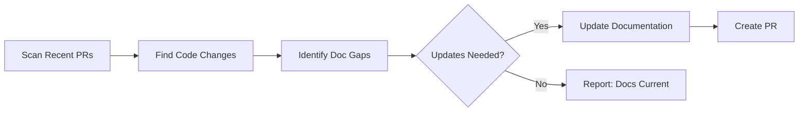

# 📖 Daily Documentation Updater

> For an overview of all available workflows, see the [main README](../README.md).

**Automatically review and update documentation based on recent code changes and merged pull requests**

The [Daily Documentation Updater workflow](../workflows/daily-doc-updater.md?plain=1) scans changes from the last 24 hours, identifies documentation gaps, and creates pull requests with updates to reflect new features, modifications, or deprecations.

## Installation

```bash
# Install the 'gh aw' extension
gh extension install github/gh-aw

# Add the workflow to your repository
gh aw add-wizard githubnext/agentics/daily-doc-updater
```

This walks you through adding the workflow to your repository.

## How It Works



The workflow follows your repository's existing documentation structure and style.

## Usage

### Configuration

This workflow requires no configuration and works out of the box. You can customize the time range, change types to document, and PR settings.

After editing run `gh aw compile` to update the workflow and commit all changes to the default branch.

### Commands

You can start a run of this workflow immediately by running:

```bash
gh aw run daily-doc-updater
```

### Triggering CI on Pull Requests

To automatically trigger CI checks on PRs created by this workflow, configure an additional repository secret `GH_AW_CI_TRIGGER_TOKEN`. See the [triggering CI documentation](https://github.github.com/gh-aw/reference/triggering-ci/) for setup instructions.
