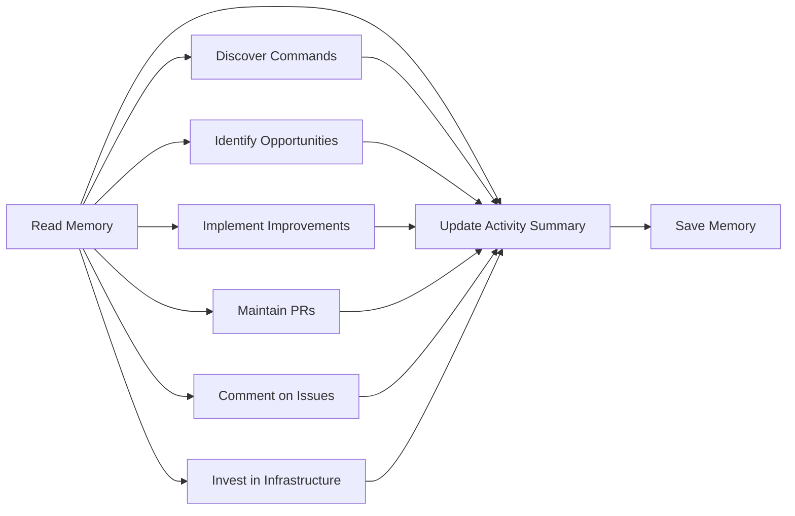

# 🌱 Daily Efficiency Improver

> For an overview of all available workflows, see the [main README](../README.md).

The [Daily Efficiency Improver workflow](../workflows/daily-efficiency-improver.md?plain=1) is an energy-efficiency-focused repository assistant that runs daily to identify and implement improvements that reduce computational footprint. It discovers build/test/benchmark commands, identifies opportunities across code, data, network/I/O, and frontend behavior, implements measurable changes, maintains its own PRs, comments on relevant issues, invests in measurement infrastructure, and maintains a monthly activity summary for maintainer visibility.

## Installation

```bash
# Install the 'gh aw' extension
gh extension install github/gh-aw

# Add the workflow to your repository
gh aw add-wizard githubnext/agentics/daily-efficiency-improver
```

This walks you through adding the workflow to your repository.

## How It Works



The workflow operates through seven coordinated tasks each run:

### Task 1: Discover and Validate Build/Test/Benchmark Commands

Analyzes the repository to discover build, test, benchmark, lint/format, and profiling commands. Cross-references against CI/config files, validates by running them, and stores successful commands in memory.

### Task 2: Identify Energy Efficiency Opportunities

Systematically scans for energy-related opportunities in four focus areas: code-level efficiency, data efficiency, network/I/O efficiency, and frontend/UI efficiency. Prioritizes opportunities by estimated impact and measurability.

### Task 3: Implement Energy Efficiency Improvements

Selects optimization goals from backlog, establishes baseline measurements, implements improvements, and measures outcomes. Creates draft PRs with before/after evidence, trade-offs, and reproducibility instructions.

### Task 4: Maintain Efficiency Improver Pull Requests

Keeps its own PRs healthy by fixing CI failures and resolving merge conflicts. Uses `push_to_pull_request_branch` to update PR branches directly.

### Task 5: Comment on Efficiency-Related Issues

Reviews open issues mentioning efficiency, performance, energy, or green software concerns. Suggests actionable investigation and measurement approaches. Maximum 3 comments per run.

### Task 6: Invest in Energy Measurement Infrastructure

Assesses benchmark and profiling coverage, identifies blind spots, and proposes or implements infrastructure improvements to better track and prevent efficiency regressions.

### Task 7: Update Monthly Activity Summary

Every run, updates a rolling monthly activity issue that gives maintainers one place to review efficiency work and suggested follow-up actions.

### Guidelines Daily Efficiency Improver Follows

- **Measure everything**: No efficiency claim without data
- **No breaking changes**: Never changes public APIs without explicit approval
- **No new dependencies**: Discusses in an issue first
- **Small, focused PRs**: One optimization per PR for easier review and rollback
- **Read AGENTS.md first**: Before starting work, reads project-specific conventions
- **AI transparency**: Every output includes robot emoji disclosure
- **Build, format, lint, and test verification**: Runs checks before creating PRs
- **Exclude generated files**: Keep benchmark artifacts out of commits unless explicitly needed

## Usage

The main way to use Daily Efficiency Improver is to let it run daily and perform tasks autonomously. You can review activity via its monthly summary issue and related PRs/comments.

### Configuration

This workflow requires no configuration and works out of the box. It uses repo-memory to track work across runs and avoid duplicate actions.

After editing run `gh aw compile` to update the workflow and commit all changes to the default branch.

### Commands

You can start a run immediately:

```bash
gh aw run daily-efficiency-improver
```

To run repeatedly:

```bash
gh aw run daily-efficiency-improver --repeat 30
```

### Triggering CI on Pull Requests

To automatically trigger CI checks on PRs created by this workflow, configure an additional repository secret `GH_AW_CI_TRIGGER_TOKEN`. See the [triggering CI documentation](https://github.github.com/gh-aw/reference/triggering-ci/) for setup instructions.

### Human in the Loop

- Review efficiency improvement PRs and measurement summaries
- Validate claims through independent checks where needed
- Assess code quality and maintainability of optimizations
- Provide feedback through issue and PR comments