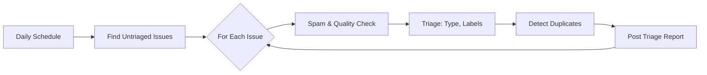

# 📋 Daily Issue Triage

> For an overview of all available workflows, see the [main README](../README.md).

**Batch-triage untriaged issues on a daily schedule**

The [Daily Issue Triage workflow](../workflows/daily-issue-triage.md?plain=1) runs once per day (or on manual dispatch) to find and triage issues that have no labels or type set. It applies the same analysis as the event-driven [Issue Triage](./issue-triage.md) workflow but processes up to 10 issues per run.

## Installation

```bash
gh aw install githubnext/agentics/workflows/daily-issue-triage.md@main
```

## When to use this vs event-driven triage

| | Event-driven (`issue-triage`) | Batch (`daily-issue-triage`) |
|---|---|---|
| **Trigger** | On issue create/reopen | Daily schedule |
| **Cost** | One run per issue | One run for up to 10 issues |
| **Latency** | Immediate (seconds) | Up to 24 hours |
| **Best for** | High-traffic repos needing instant feedback | Repos with moderate volume where next-day triage is acceptable |

You can run both together: event-driven for immediate triage, daily batch as a safety net to catch anything missed.

## How it works



The workflow searches for open issues created in the last 7 days with no labels and no type, then triages each one individually.

## Configuration

The default query finds issues with no labels created in the last 7 days. You can customize the search criteria by editing the template after installation.

## Human-in-the-loop

The daily batch workflow applies the same safe outputs as event-driven triage:
- Labels (up to 25 per run)
- Issue type (up to 10 per run)
- Comments (up to 10 per run)
- Close spam issues as "not planned" (up to 5 per run)

All actions are visible in the issue timeline and can be undone by maintainers.
