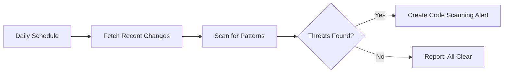

# 🔍 Daily Malicious Code Scan

> For an overview of all available workflows, see the [main README](../README.md).

The [Daily Malicious Code Scan workflow](../workflows/daily-malicious-code-scan.md?plain=1) examines files changed in the past 72 hours, searching for secret exfiltration, out-of-context code, suspicious network activity, system access patterns, obfuscation, and supply chain indicators. Findings appear as GitHub code-scanning alerts with threat scores and remediation recommendations.

## Installation

```bash
# Install the 'gh aw' extension
gh extension install github/gh-aw

# Add the workflow to your repository
gh aw add-wizard githubnext/agentics/daily-malicious-code-scan
```

This walks you through adding the workflow to your repository.

## How It Works



## Usage

### Configuration

This workflow works out of the box with any repository and programming language. No additional configuration is required.

After editing run `gh aw compile` to update the workflow and commit all changes to the default branch.

## Learn More

- [GitHub Agentic Workflows Documentation](https://github.github.io/gh-aw/)
- [GitHub Code Scanning Documentation](https://docs.github.com/en/code-security/code-scanning/introduction-to-code-scanning/about-code-scanning)
