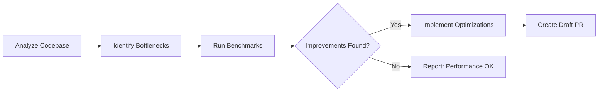

# ⚡ Daily Performance Improver

> For an overview of all available workflows, see the [main README](../README.md).

**Analyze code performance, identify bottlenecks, and implement optimizations through benchmarking**

The [Daily Performance Improver workflow](../workflows/daily-perf-improver.md?plain=1) analyzes your codebase for performance issues, runs benchmarks, and creates draft pull requests with optimizations.

## Installation

```bash
# Install the 'gh aw' extension
gh extension install github/gh-aw

# Add the workflow to your repository
gh aw add-wizard githubnext/agentics/daily-perf-improver
```

This walks you through adding the workflow to your repository.

## How It Works



The workflow searches for performance optimization techniques and best practices online to inform its analysis.

## Usage

### Configuration

The first run creates a pull request with inferred action pre-steps requiring approval and an issue with a performance improvement plan. Subsequent runs implement optimizations based on the plan.

After editing run `gh aw compile` to update the workflow and commit all changes to the default branch.

### Commands

You can start a run immediately:

```bash
gh aw run daily-perf-improver
```

To run repeatedly:

```bash
gh aw run daily-perf-improver --repeat 30
```

### Triggering CI on Pull Requests

To automatically trigger CI checks on PRs created by this workflow, configure an additional repository secret `GH_AW_CI_TRIGGER_TOKEN`. See the [triggering CI documentation](https://github.github.com/gh-aw/reference/triggering-ci/) for setup instructions.

### Human in the Loop

- Review performance improvement PRs and benchmark results
- Validate performance gains through independent testing
- Assess code quality and maintainability of optimizations
