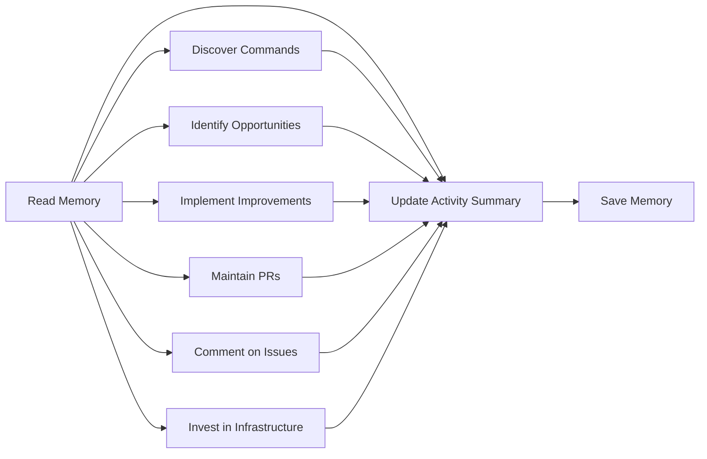

# ⚡ Daily Performance Improver

> For an overview of all available workflows, see the [main README](../README.md).

The [Daily Performance Improver workflow](../workflows/daily-perf-improver.md?plain=1) is a performance-focused repository assistant that runs daily to identify and implement performance improvements. It can also be triggered on-demand via `/perf-assist <instructions>` to perform specific tasks. It discovers build/benchmark commands, identifies optimization opportunities, implements improvements with measured impact, maintains its own PRs, comments on performance issues, invests in measurement infrastructure, and maintains a monthly activity summary for maintainer visibility.

## Installation

```bash
# Install the 'gh aw' extension
gh extension install github/gh-aw

# Add the workflow to your repository
gh aw add-wizard githubnext/agentics/daily-perf-improver
```

This walks you through adding the workflow to your repository.

## How It Works



The workflow operates through seven coordinated tasks each run:

### Task 1: Discover and Validate Build/Test/Perf Commands

Analyzes the repository to discover build commands, test commands, benchmark commands, lint/format tools, and profiling tools. Cross-references against CI files and validates by running them. Stores validated commands in memory for future runs.

### Task 2: Identify Performance Opportunities

Researches the performance landscape: current tooling, user-facing concerns, system bottlenecks, and development workflow issues. Prioritizes opportunities by impact (user-facing > internal), feasibility (low-risk > high-risk), and measurability.

### Task 3: Implement Performance Improvements

Selects optimization goals from the backlog, establishes baseline measurements, implements optimizations, and measures impact. Creates draft PRs with evidence of performance gains, trade-offs documented, and reproducibility instructions.

### Task 4: Maintain Perf Improver Pull Requests

Keeps its own PRs healthy by fixing CI failures and resolving merge conflicts. Uses `push_to_pull_request_branch` to update PR branches directly.

### Task 5: Comment on Performance Issues

Reviews open issues with `performance` label or mentioning performance. Suggests profiling approaches, measurement strategies, and offers to investigate. Maximum 3 comments per run.

### Task 6: Invest in Performance Measurement Infrastructure

Assesses existing benchmark suites, profiling tools, and CI performance regression detection. Discovers real-world performance priorities from user issues. Proposes or implements infrastructure improvements like new benchmarks or measurement harnesses.

### Task 7: Update Monthly Activity Summary

Every run, updates a rolling monthly activity issue that gives maintainers a single place to see all performance work and suggested actions.

### Guidelines Perf Improver Follows

- **Measure everything**: No performance claim without data
- **No breaking changes**: Never changes public APIs without explicit approval
- **No new dependencies**: Discusses in an issue first
- **Small, focused PRs**: One optimization per PR for easy measurement and revert
- **Read AGENTS.md first**: Before starting work, reads project-specific conventions
- **AI transparency**: Every output includes robot emoji disclosure
- **Build, format, lint, and test verification**: Runs all checks before creating PRs
- **Exclude generated files**: Performance reports go in PR description, not commits

## Usage

The main way to use Daily Perf Improver is to let it run daily and perform its tasks autonomously. You will see its activity summarized in the monthly activity issue it maintains, and you can review its PRs and comments as they come in.

### Configuration

This workflow requires no configuration and works out of the box. It uses repo-memory to track work across runs and avoid duplicate actions.

After editing run `gh aw compile` to update the workflow and commit all changes to the default branch.

### Commands

You can start a run immediately:

```bash
gh aw run daily-perf-improver
```

To run repeatedly:

```bash
gh aw run daily-perf-improver --repeat 30
```

### Usage as a General-Purpose Performance Assistant

You can also trigger Perf Improver on-demand by commenting on any issue or PR:

```text
/perf-assist <instructions>
```

When triggered this way, Perf Improver focuses exclusively on your instructions instead of running its normal scheduled tasks. For example:

- `/perf-assist profile this function and suggest optimizations`
- `/perf-assist add benchmarks for the new API endpoints`
- `/perf-assist investigate why CI is slower after this PR`

### Triggering CI on Pull Requests

To automatically trigger CI checks on PRs created by this workflow, configure an additional repository secret `GH_AW_CI_TRIGGER_TOKEN`. See the [triggering CI documentation](https://github.github.com/gh-aw/reference/triggering-ci/) for setup instructions.

### Human in the Loop

- Review performance improvement PRs and benchmark results
- Validate performance gains through independent testing
- Assess code quality and maintainability of optimizations
- Provide feedback via comments on the monthly activity issue
