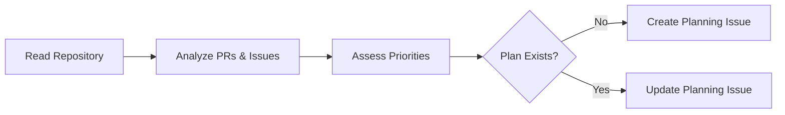

# 📋 Daily Plan

> For an overview of all available workflows, see the [main README](../README.md).

**Run daily to update a planning issue for the team with current priorities**

The [Daily Plan workflow](../workflows/daily-plan.md?plain=1) reads repository contents and pull request metadata, assesses priorities, and creates or updates planning issues that other workflows can reference for team priorities.

## Installation

```bash
# Install the 'gh aw' extension
gh extension install github/gh-aw

# Add the workflow to your repository
gh aw add-wizard githubnext/agentics/daily-plan
```

This walks you through adding the workflow to your repository.

## How It Works



## Usage

### Configuration

This workflow requires no configuration and works out of the box. You can customize the planning and report format.

After editing run `gh aw compile` to update the workflow and commit all changes to the default branch.

### Commands

You can start a run of this workflow immediately by running:

```bash
gh aw run daily-plan
```
