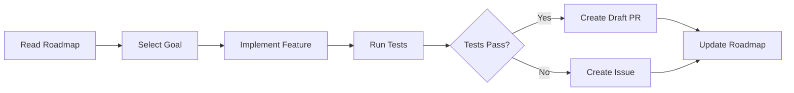

# 📈 Daily Progress

> For an overview of all available workflows, see the [main README](../README.md).

**Autonomous developer that works systematically on your repository's feature roadmap**

The [Daily Progress workflow](../workflows/daily-progress.md?plain=1) runs daily (Monday–Friday at 2am UTC) to research project goals, create development plans, and implement features through a structured multi-step process.

## Installation

```bash
# Install the 'gh aw' extension
gh extension install github/gh-aw

# Add the workflow to your repository
gh aw add-wizard githubnext/agentics/daily-progress
```

This walks you through adding the workflow to your repository.

## How It Works



The workflow follows a systematic process: roadmap research, build configuration (`.github/actions/daily-progress/build-steps/action.yml`), goal selection, feature development, PR creation, and roadmap updates.

## Usage

### Configuration

The workflow self-configures by creating a build configuration file at `.github/actions/daily-progress/build-steps/action.yml`.

After editing run `gh aw compile` to update the workflow and commit all changes to the default branch.

### Commands

You can start a run of this workflow immediately by running:

```bash
gh aw run daily-progress
```

### Triggering CI on Pull Requests

To automatically trigger CI checks on PRs created by this workflow, configure an additional repository secret `GH_AW_CI_TRIGGER_TOKEN`. See the [triggering CI documentation](https://github.github.com/gh-aw/reference/triggering-ci/) for setup instructions.
