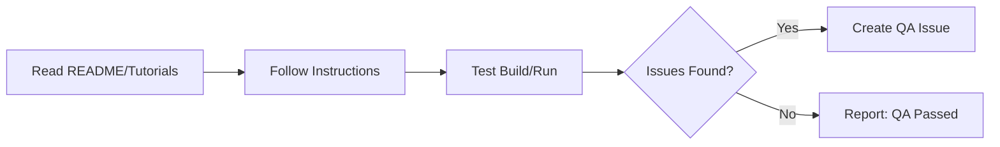

# 🔍 Daily Ad hoc QA

> For an overview of all available workflows, see the [main README](../README.md).

**Perform ad hoc quality assurance by following README instructions, tutorials, and walkthroughs**

The [Daily Ad hoc QA workflow](../workflows/daily-qa.md?plain=1) reads your documentation, follows instructions, tests build and run processes, and creates issues for problems found.

## Installation

```bash
# Install the 'gh aw' extension
gh extension install github/gh-aw

# Add the workflow to your repository
gh aw add-wizard githubnext/agentics/daily-qa
```

This walks you through adding the workflow to your repository.

## How It Works



## Usage

### Configuration

This workflow requires no configuration and works out of the box. You can customize QA tasks, testing scenarios, reporting format, and frequency.

After editing run `gh aw compile` to update the workflow and commit all changes to the default branch.

### Commands

You can start a run of this workflow immediately by running:

```bash
gh aw run daily-qa
```

### Triggering CI on Pull Requests

To automatically trigger CI checks on PRs created by this workflow, configure an additional repository secret `GH_AW_CI_TRIGGER_TOKEN`. See the [triggering CI documentation](https://github.github.com/gh-aw/reference/triggering-ci/) for setup instructions.
