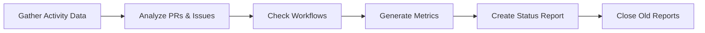

# 👥 Daily Repo Status

> For an overview of all available workflows, see the [main README](../README.md).

**Assess repository activity and create status report issues**

The [Daily Repo Status workflow](../workflows/daily-repo-status.md?plain=1) gathers activity data, analyzes PRs and issues, checks workflow results, and creates status report issues. Previous reports are automatically closed when new ones are created.

## Installation

```bash
# Install the 'gh aw' extension
gh extension install github/gh-aw

# Add the workflow to your repository
gh aw add-wizard githubnext/agentics/daily-repo-status
```

This walks you through adding the workflow to your repository.

## How It Works



Reports are created with the `[team-status]` prefix.

## Usage

### Configuration

This workflow requires no configuration and works out of the box. You can customize triage criteria, labeling logic, and report format.

After editing run `gh aw compile` to update the workflow and commit all changes to the default branch.

### Commands

You can start a run of this workflow immediately by running:

```bash
gh aw run daily-repo-status
```
