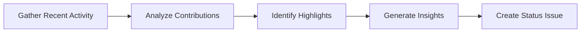

# 👥 Daily Team Status

> For an overview of all available workflows, see the [main README](../README.md).

**Create daily team status reports with upbeat activity summaries**

The [Daily Team Status workflow](../workflows/daily-team-status.md?plain=1) gathers recent repository activity (issues, PRs, discussions, releases, code changes) and generates engaging status issues with productivity insights, community highlights, and project recommendations.

## Installation

```bash
# Install the 'gh aw' extension
gh extension install github/gh-aw

# Add the workflow to your repository
gh aw add-wizard githubnext/agentics/daily-team-status
```

This walks you through adding the workflow to your repository.

## How It Works



Issues are created with the `[team-status]` prefix using a positive, encouraging tone.

## Usage

### Configuration

This workflow requires no configuration and works out of the box. You can customize the tone, included metrics, and reporting frequency.

After editing run `gh aw compile` to update the workflow and commit all changes to the default branch.

### Commands

You can start a run of this workflow immediately by running:

```bash
gh aw run daily-team-status
```
