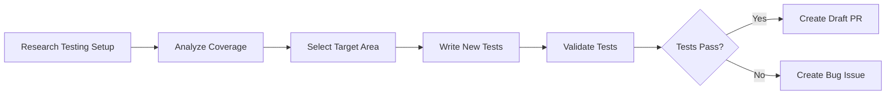

# 🧪 Daily Test Coverage Improver

> For an overview of all available workflows, see the [main README](../README.md).

**Analyze test coverage and add tests to improve coverage in under-tested areas**

The [Daily Test Coverage Improver workflow](../workflows/daily-test-improver.md?plain=1) analyzes your test coverage, writes new tests, and submits draft PRs with coverage improvements.

## Installation

```bash
# Install the 'gh aw' extension
gh extension install github/gh-aw

# Add the workflow to your repository
gh aw add-wizard githubnext/agentics/daily-test-improver
```

This walks you through adding the workflow to your repository.

## How It Works



The workflow operates in two phases:

**Phase 1 - Testing Research:** On the first run, researches the testing landscape, identifies build and coverage commands, and creates a discussion with the plan. Memory notes are stored in a `memory/daily-test-improver` branch.

**Phase 2 - Test Development:** On subsequent runs, consults memory notes, selects a coverage area to improve, writes new tests, and submits draft PRs.

## Usage

### Configuration

The first run creates a discussion with a research summary and plan. Review the plan and provide feedback via comments.

After editing run `gh aw compile` to update the workflow and commit all changes to the default branch.

### Commands

You can start a run immediately:

```bash
gh aw run daily-test-improver
```

### Triggering CI on Pull Requests

To automatically trigger CI checks on PRs created by this workflow, configure an additional repository secret `GH_AW_CI_TRIGGER_TOKEN`. See the [triggering CI documentation](https://github.github.com/gh-aw/reference/triggering-ci/) for setup instructions.

### Human in the Loop

- Review the initial research discussion and provide feedback
- Validate that new tests properly cover edge cases
- Ensure tests are meaningful and not just coverage-padding
