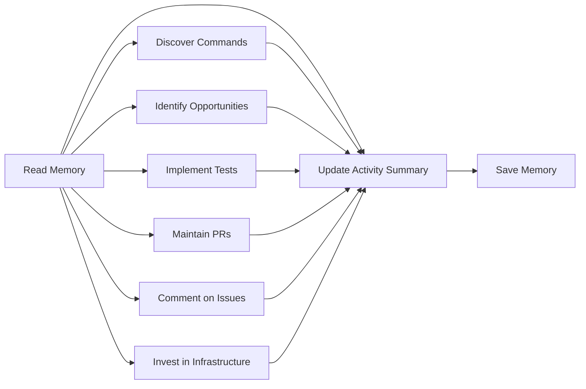

# 🧪 Daily Test Improver

> For an overview of all available workflows, see the [main README](../README.md).

The [Daily Test Improver workflow](../workflows/daily-test-improver.md?plain=1) is a testing-focused repository assistant that runs daily to improve test quality and coverage. It can also be triggered on-demand via `/test-assist <instructions>` to perform specific tasks. It discovers build/test/coverage commands, identifies high-value testing opportunities, implements test improvements with measured impact, maintains its own PRs, comments on testing issues, invests in test infrastructure, and maintains a monthly activity summary for maintainer visibility.

## Installation

```bash
# Install the 'gh aw' extension
gh extension install github/gh-aw

# Add the workflow to your repository
gh aw add-wizard githubnext/agentics/daily-test-improver
```

This walks you through adding the workflow to your repository.

## How It Works



The workflow operates through seven coordinated tasks each run:

### Task 1: Discover and Validate Build/Test/Coverage Commands

Analyzes the repository to discover build commands, test commands, coverage generation commands, lint/format tools, and testing frameworks. Cross-references against CI files and validates by running them. Stores validated commands in memory for future runs.

### Task 2: Identify High-Value Testing Opportunities

Researches the testing landscape: current organization, frameworks, coverage reports, and open issues. Focuses on value, not just coverage numbers - prioritizes bug-prone areas, critical paths, untested edge cases, and integration points. Records maintainer priorities from comments.

### Task 3: Implement Test Improvements

Selects testing goals from the backlog aligned with maintainer priorities. Implements new tests, edge case coverage, regression tests, or test refactoring. Creates draft PRs with coverage impact documented.

### Task 4: Maintain Test Improver Pull Requests

Keeps its own PRs healthy by fixing CI failures and resolving merge conflicts. Uses `push_to_pull_request_branch` to update PR branches directly.

### Task 5: Comment on Testing Issues

Reviews open issues mentioning tests or coverage. Suggests testing approaches, points to related patterns, and offers to implement. Maximum 3 comments per run.

### Task 6: Invest in Test Infrastructure

Assesses existing test utilities, fixtures, and CI configuration. Identifies infrastructure gaps like missing helpers or slow test suites. Proposes or implements improvements like shared fixtures or coverage reporting.

### Task 7: Update Monthly Activity Summary

Every run, updates a rolling monthly activity issue that gives maintainers a single place to see all testing work, maintainer priorities noted, and suggested actions.

### Guidelines Test Improver Follows

- **Value over coverage**: A test that catches real bugs beats tests that just increase coverage numbers
- **No breaking changes**: Never changes public APIs without explicit approval
- **No new dependencies**: Discusses in an issue first
- **Small, focused PRs**: One testing goal per PR for easy review
- **Read AGENTS.md first**: Before starting work, reads project-specific conventions
- **AI transparency**: Every output includes robot emoji disclosure
- **Build, format, lint, and test verification**: Runs all checks before creating PRs
- **Exclude generated files**: Coverage reports go in PR description, not commits

## Usage

The main way to use Daily Test Improver is to let it run daily and perform its tasks autonomously. You will see its activity summarized in the monthly activity issue it maintains, and you can review its PRs and comments as they come in.

### Configuration

This workflow requires no configuration and works out of the box. It uses repo-memory to track work across runs and avoid duplicate actions.

After editing run `gh aw compile` to update the workflow and commit all changes to the default branch.

### Commands

You can start a run immediately:

```bash
gh aw run daily-test-improver
```

To run repeatedly:

```bash
gh aw run daily-test-improver --repeat 30
```

### Usage as a General-Purpose Testing Assistant

You can also trigger Test Improver on-demand by commenting on any issue or PR:

```text
/test-assist <instructions>
```

When triggered this way, Test Improver focuses exclusively on your instructions instead of running its normal scheduled tasks. For example:

- `/test-assist add tests for this new feature`
- `/test-assist investigate why this test is flaky`
- `/test-assist add edge case tests for error handling`

### Triggering CI on Pull Requests

To automatically trigger CI checks on PRs created by this workflow, configure an additional repository secret `GH_AW_CI_TRIGGER_TOKEN`. See the [triggering CI documentation](https://github.github.com/gh-aw/reference/triggering-ci/) for setup instructions.

### Human in the Loop

- Review test improvement PRs and coverage results
- Validate that new tests properly cover edge cases
- Ensure tests are meaningful and maintainable
- Provide feedback via comments on the monthly activity issue
