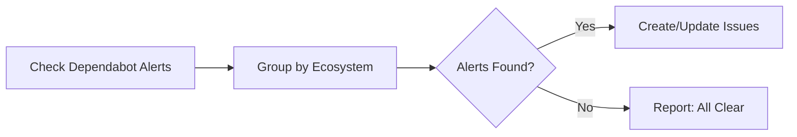

# 📦 Dependabot Issue Bundler

> For an overview of all available workflows, see the [main README](../README.md).

**Check for Dependabot alerts and manage issues that group updates by runtime/ecosystem**

The [Dependabot Issue Bundler workflow](../workflows/dependabot-issue-bundler.md?plain=1) checks for Dependabot alerts and creates issues grouping updates by ecosystem (Go, Java, etc.).

## Installation

```bash
# Install the 'gh aw' extension
gh extension install github/gh-aw

# Add the workflow to your repository
gh aw add-wizard githubnext/agentics/dependabot-issue-bundler
```

This walks you through adding the workflow to your repository.

## How It Works



## Usage

### Configuration

This workflow requires no configuration and works out of the box.

After editing run `gh aw compile` to update the workflow and commit all changes to the default branch.

### Commands

You can start a run immediately:

```bash
gh aw run dependabot-issue-bundler
```

### Human in the Loop

- Review dependency update PRs for breaking changes
- Test updated dependencies for compatibility
- Monitor for issues after updates are deployed
