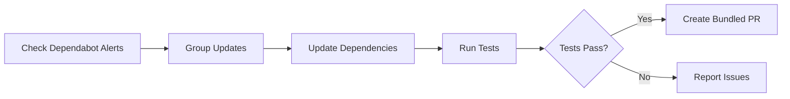

# 📦 Dependabot PR Bundler

> For an overview of all available workflows, see the [main README](../README.md).

**Bundle Dependabot alerts into grouped pull requests with full dependency updates**

The [Dependabot PR Bundler workflow](../workflows/dependabot-pr-bundler.md?plain=1) checks for Dependabot alerts, groups updates, updates dependencies to latest versions, tests compatibility, and creates bundled pull requests.

## Installation

```bash
# Install the 'gh aw' extension
gh extension install github/gh-aw

# Add the workflow to your repository
gh aw add-wizard githubnext/agentics/dependabot-pr-bundler
```

This walks you through adding the workflow to your repository.

## How It Works



## Usage

### Configuration

This workflow requires no configuration and works out of the box.

After editing run `gh aw compile` to update the workflow and commit all changes to the default branch.

### Commands

You can start a run immediately:

```bash
gh aw run dependabot-pr-bundler
```

### Triggering CI on Pull Requests

To automatically trigger CI checks on PRs created by this workflow, configure an additional repository secret `GH_AW_CI_TRIGGER_TOKEN`. See the [triggering CI documentation](https://github.github.com/gh-aw/reference/triggering-ci/) for setup instructions.

### Human in the Loop

- Review dependency update PRs for breaking changes
- Test updated dependencies for compatibility
- Monitor for issues after updates are deployed
