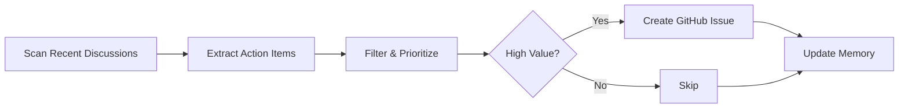

# 🔍 Discussion Task Miner

> For an overview of all available workflows, see the [main README](../README.md).

**Automatically extract actionable tasks from GitHub Discussions and create trackable issues**

The [Discussion Task Miner workflow](../workflows/discussion-task-miner.md?plain=1) runs daily to scan recent GitHub Discussions for actionable improvement opportunities. It identifies concrete, well-scoped tasks and converts them into GitHub issues (up to 5 per run), bridging the gap between discussion insights and tracked work items.

## Installation

```bash
# Install the 'gh aw' extension
gh extension install github/gh-aw

# Add the workflow to your repository
gh aw add-wizard githubnext/agentics/discussion-task-miner
```

This walks you through adding the workflow to your repository.

## How It Works



The workflow reads discussions from the last 7 days, analyzes their content for recommendations, action items, and improvement suggestions, then converts the top findings into focused, actionable GitHub issues. It uses repo-memory to avoid re-processing the same discussions across runs.

## Prerequisites

GitHub Discussions must be enabled for your repository. The workflow works best in repositories that generate discussion content from other agentic workflows (such as analysis reports, quality audits, or review summaries), though it can also mine any human-authored discussions containing improvement suggestions.

## Examples

Based on usage in the gh-aw repository: **57% merge rate** (60 merged PRs out of 105 proposed through a discussion → issue → PR causal chain). The workflow demonstrates how insights buried in discussions can be surfaced as trackable work—a verified example chain: [Discussion #13934](https://github.com/github/gh-aw/discussions/13934) → [Issue #14084](https://github.com/github/gh-aw/issues/14084) → [PR #14129](https://github.com/github/gh-aw/pull/14129).

## Usage

### Configuration

The workflow is configured to:
- Run daily
- Create max 5 issues per run
- Auto-expire issues after 1 day if not addressed
- Use repo-memory to track processed discussions and avoid duplicates

To customize which types of tasks to extract, edit the "Focus Areas" and "Task Extraction Criteria" sections in the workflow file. After editing, run `gh aw compile` to update the workflow and commit all changes to the default branch.

### Pairing with Other Workflows

This workflow pairs especially well with other analysis workflows that post findings as discussions:
- [Daily Accessibility Review](daily-accessibility-review.md)
- [Daily Adhoc QA](daily-qa.md)
- [Daily Malicious Code Scan](daily-malicious-code-scan.md)
- [Daily Performance Improver](daily-perf-improver.md)

## Learn More

- [GitHub Agentic Workflows Documentation](https://github.github.io/gh-aw/)
- [Blog: Agentic Workflow Campaigns & Multi-Phase Workflows](https://github.github.io/gh-aw/blog/2026-01-13-meet-the-workflows-campaigns/)
