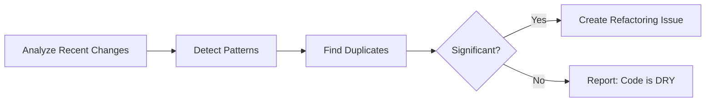

# 🔍 Duplicate Code Detector

> For an overview of all available workflows, see the [main README](../README.md).

**Automatically identify duplicate code patterns and suggest refactoring opportunities**

The [Duplicate Code Detector workflow](../workflows/duplicate-code-detector.md?plain=1) runs daily to analyze recent code changes and detect duplicate patterns. It creates focused issues (max 3 per run) for significant duplication patterns, automatically assigned to @copilot for potential remediation.

## Installation

```bash
# Install the 'gh aw' extension
gh extension install github/gh-aw

# Add the workflow to your repository
gh aw add-wizard githubnext/agentics/duplicate-code-detector
```

This walks you through adding the workflow to your repository.

## How It Works



The workflow reports identical or nearly identical functions, repeated code blocks, similar classes with overlapping functionality, and copy-pasted code. It excludes standard boilerplate, test setup code, config files, and small snippets (<5 lines).

## Examples

Based on usage in the gh-aw repository: **79% merge rate** (76 merged PRs out of 96 proposed).

## Usage

### Configuration

The workflow is configured to:
- Run daily
- Create max 3 issues per run
- Auto-expire issues after 2 days if not addressed
- Skip test files, generated code, and workflow files

After editing run `gh aw compile` to update the workflow and commit all changes to the default branch.

## Learn More

- [GitHub Agentic Workflows Documentation](https://github.github.io/gh-aw/)
- [Blog: Continuous Simplicity Workflows](https://github.github.io/gh-aw/blog/2026-01-13-meet-the-workflows-continuous-simplicity/)
