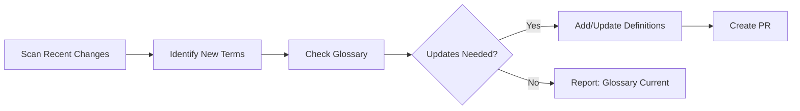

# 📖 Glossary Maintainer

> For an overview of all available workflows, see the [main README](../README.md).

**Automatically maintain project glossary by scanning code changes and keeping technical terms up-to-date**

The [Glossary Maintainer workflow](../workflows/glossary-maintainer.md?plain=1) runs on weekdays to scan recent changes, identify new technical terminology, and create pull requests with glossary updates.

## Installation

```bash
# Install the 'gh aw' extension
gh extension install github/gh-aw

# Add the workflow to your repository
gh aw add-wizard githubnext/agentics/glossary-maintainer
```

This walks you through adding the workflow to your repository.

## How It Works



- **Daily (Mon-Fri)**: Incremental scan of last 24 hours
- **Monday**: Full scan of last 7 days for comprehensive review

The workflow locates your glossary file automatically (common paths: `docs/glossary.md`, `GLOSSARY.md`) and follows your existing structure and style.

## Usage

### Configuration

This workflow works out of the box. You can customize the glossary file path, scanning timeframe, and PR settings.

After editing run `gh aw compile` to update the workflow and commit all changes to the default branch.

### Commands

You can start a run immediately:

```bash
gh aw run glossary-maintainer
```

### Triggering CI on Pull Requests

To automatically trigger CI checks on PRs created by this workflow, configure an additional repository secret `GH_AW_CI_TRIGGER_TOKEN`. See the [triggering CI documentation](https://github.github.com/gh-aw/reference/triggering-ci/) for setup instructions.

## Learn More

- [Meet the Workflows: Continuous Documentation](https://github.github.io/gh-aw/blog/2026-01-13-meet-the-workflows-documentation/)
