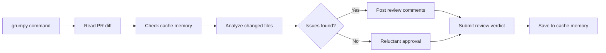

# 😤 Grumpy Reviewer

> For an overview of all available workflows, see the [main README](../README.md).

**On-demand code review by a grumpy but thorough senior developer**

The [Grumpy Reviewer workflow](../workflows/grumpy-reviewer.md?plain=1) is an on-demand code reviewer with personality. Invoke it on any pull request to get an opinionated, thorough review focused on real problems: security risks, performance issues, bad naming, and missing error handling.

## Installation

```bash
# Install the 'gh aw' extension
gh extension install github/gh-aw

# Add the workflow to your repository
gh aw add-wizard githubnext/agentics/grumpy-reviewer
```

This walks you through adding the workflow to your repository.

## How It Works



The reviewer hunts for code smells, security concerns, performance issues, and best practices violations. Posts up to 5 specific, actionable inline comments and submits a verdict (approve, request changes, or comment).

## Usage

### Usage as a General-Purpose Assistant

Trigger on any pull request:

```
/grumpy
```

Or with a specific focus:

```
/grumpy focus on security
/grumpy check error handling especially
```

### Configuration

The workflow runs with sensible defaults:
- **Max comments**: 5
- **Timeout**: 10 minutes
- **Trigger**: `/grumpy` command in PR comments

After editing run `gh aw compile` to update the workflow and commit all changes to the default branch.

### Human in the Loop

- The reviewer posts comments and submits a verdict, but you decide whether to act on them
- Close or dismiss review comments you disagree with
- The `REQUEST_CHANGES` verdict doesn't block merging - it's a recommendation
