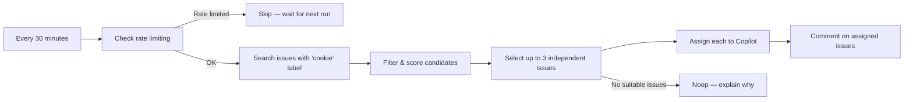

# 👾 Issue Monster

> For an overview of all available workflows, see the [main README](../README.md).

**Automated workflow that assigns approved issues to the Copilot coding agent every 30 minutes**

The [Issue Monster workflow](../workflows/issue-monster.md?plain=1) is the Cookie Monster of issues 🍪 — it runs every 30 minutes, scans the issue tracker for open issues labeled `cookie`, scores and prioritizes them, and assigns up to three per run to the Copilot coding agent for automated resolution.

## Installation

```bash
# Install the 'gh aw' extension
gh extension install github/gh-aw

# Add the workflow to your repository
gh aw add-wizard githubnext/agentics/issue-monster
```

This walks you through adding the workflow to your repository.

## How It Works



### Pre-Activation Job

Before the agent runs, a GitHub Actions job searches for candidate issues, applies all filtering, scores them by priority, and passes the results to the agent. This means the agent gets a clean, pre-ranked list without needing to make extra API calls.

### Smart Filtering

The workflow skips issues that are:

| Condition | Reason |
|-----------|--------|
| Already assigned | Avoid duplicate work |
| Have open Copilot PRs | Already being worked on |
| Have closed/merged PRs | Treating as complete |
| Are parent issues with sub-issues | Organizing issues, not tasks |
| Carry exclusion labels | `wontfix`, `duplicate`, `blocked`, `no-bot`, etc. |
| Have `campaign:*` labels | Managed by campaign orchestrators |

### Priority Scoring

Issues are scored and ranked before the agent sees them:

| Label | Points |
|-------|--------|
| `community` | +60 *(external contributors always first)* |
| `good first issue` | +50 |
| `security` | +45 |
| `bug` | +40 |
| `documentation` | +35 |
| `enhancement` / `feature` | +30 |
| `performance` | +25 |
| `tech-debt` / `refactoring` | +20 |
| Has any priority label | +10 |
| Age bonus (older issues) | +0–20 |

### Topic Separation

The three selected issues must be completely independent in scope — different areas of the codebase, different components, no overlapping file changes. This prevents conflicting pull requests.

### Sibling Awareness

For sub-issues of a common parent (with `task` or `plan` labels), the workflow processes them one at a time, oldest first. If one sibling already has an open Copilot PR, all other siblings are skipped until it's merged or closed.

### Rate-Limit Protection

Before each run, the workflow checks recent Copilot PRs for comments indicating API rate limiting. If rate limiting is detected, the run is skipped entirely to avoid making things worse.

## The `cookie` Label

Issue Monster only processes issues labeled `cookie`. This label acts as a work-queue gate — it signals that an issue has been reviewed and approved for automated resolution. Add this label manually or automate it with another workflow (for example, your triage workflow can add `cookie` to issues that are suitable for the Copilot coding agent).

## Configuration

After installing, you can customize the workflow by editing `workflows/issue-monster.md`:

- **Exclusion labels**: Edit the `excludeLabels` array in the pre-activation script
- **Priority scores**: Adjust the scoring values in the `.map(issue => ...)` section
- **Issues per run**: Change `max: 3` in the `assign-to-agent` safe-output
- **Schedule**: Modify `schedule: every 30m` (e.g., `every 1h`, `daily`)

After editing, run `gh aw compile` to apply your changes.

## Permissions Required

- `contents: read` — Read repository contents
- `issues: read` — Search and read issues
- `pull-requests: read` — Check for existing Copilot PRs
- `copilot-requests: write` — Assign issues to the Copilot coding agent

## Example Run

A typical run looks like this:

1. Pre-activation job finds 12 open `cookie` issues
2. Rate-limit check passes (no recent rate-limited PRs)
3. After filtering: 5 candidate issues remain
4. Agent selects 3 that are independent in topic
5. Agent assigns each to Copilot and posts a comment:

> 🍪 **Issue Monster selected this for Copilot**
>
> I've identified this issue as a good candidate for automated resolution and requested assignment to the Copilot coding agent.
>
> If assignment succeeds, the Copilot coding agent will analyze the issue and create a pull request with the fix.
>
> Om nom nom! 🍪

## Learn More

- [Issue Monster source workflow](https://github.com/github/gh-aw/blob/main/.github/workflows/issue-monster.md)
- [Sub-Issue Closer](sub-issue-closer.md) — automatically closes parent issues when all sub-issues are complete
- [Issue Arborist](issue-arborist.md) — automatically organize issues by linking related issues as parent-child sub-issues
- [Issue Triage](issue-triage.md) — label and prioritize new issues (can add the `cookie` label to suitable issues)
