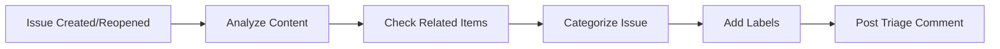

# 🏷️ Issue Triage

> For an overview of all available workflows, see the [main README](../README.md).

**Automatically triage issues when they are created or reopened**

The [Issue Triage workflow](../workflows/issue-triage.md?plain=1) runs when issues are created or reopened to analyze content, check related items, categorize, add labels, and post triage comments.

## Installation

```bash
# Install the 'gh aw' extension
gh extension install github/gh-aw

# Add the workflow to your repository
gh aw add-wizard githubnext/agentics/issue-triage
```

This walks you through adding the workflow to your repository.

## How It Works



The workflow may search for relevant documentation, error messages, or similar issues online to assist with triage.

## Usage

This workflow triggers automatically when issues are created or reopened—you cannot start it manually.

### Configuration

This workflow requires no configuration and works out of the box. You can customize triage criteria, labeling logic, and automated responses.

After editing run `gh aw compile` to update the workflow and commit all changes to the default branch.

### Human in the Loop

- Review triage comments for accuracy
- Validate label assignments and priority assessments
- Override or adjust triage decisions when needed
