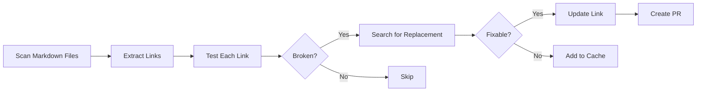

# 🔗 Link Checker

> For an overview of all available workflows, see the [main README](../README.md).

**Scan documentation for broken links, find replacements, and create PRs with fixes**

The [Link Checker workflow](../workflows/link-checker.md?plain=1) scans markdown files for HTTP(S) links, tests each one, finds replacements for broken links, and creates pull requests with fixes. Uses cache memory to avoid repeated attempts on unfixable links.

## Installation

```bash
# Install the 'gh aw' extension
gh extension install github/gh-aw

# Add the workflow to your repository
gh aw add-wizard githubnext/agentics/link-checker
```

This walks you through adding the workflow to your repository.

## How It Works



A bash script pre-processes links before the AI agent runs. The agent investigates broken links, tries common variations (www, http vs https), and uses web-fetch to find where content moved.

## Usage

The workflow runs on weekdays with a 60-minute timeout. Creates ready-to-review PRs labeled `documentation` and `automated`.

### Configuration

After editing run `gh aw compile` to update the workflow and commit all changes to the default branch.

### Triggering CI on Pull Requests

To automatically trigger CI checks on PRs created by this workflow, configure an additional repository secret `GH_AW_CI_TRIGGER_TOKEN`. See the [triggering CI documentation](https://github.github.com/gh-aw/reference/triggering-ci/) for setup instructions.
