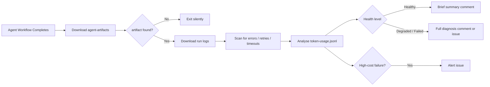

# 🔍 Log Watcher

> For an overview of all available workflows, see the [main README](../README.md).

**Automated agent run diagnostics that scan logs and token data for errors, retry loops, and anomalies after every agent workflow run**

The [Log Watcher workflow](../workflows/log-watcher.md?plain=1) fires after your configured agent workflows complete, downloads the `agent-artifacts` artifact written by gh-aw's firewall, scans the run logs for error patterns and retry loops, analyses token usage for anomalies, and posts a health diagnosis on the associated pull request or creates a diagnosis issue.

## Installation

```bash
# Install the 'gh aw' extension
gh extension install github/gh-aw

# Add the workflow to your repository
gh aw add-wizard githubnext/agentics/log-watcher
```

This walks you through adding the workflow to your repository.

## How It Works



The workflow reads both the GitHub Actions run logs (via `gh run view --log`) and the
`token-usage.jsonl` file from the `agent-artifacts` artifact. It combines log signals
(errors, timeouts, retry loops) with token metrics (output ratio, cache efficiency, model
mixing) to assign a health level and write a plain-English diagnosis.

Runs that do not produce an `agent-artifacts` artifact (non-agent CI workflows) are
skipped silently.

## Usage

### Configuration

After installing, open the workflow file and update the `workflows` list under `on.workflow_run`
to match the names of your agent workflows:

```yaml
on:
  workflow_run:
    workflows: ["agent-implement", "agent-pr-fix"]  # your workflow names here
    types:
      - completed
```

To adjust the high-cost failure alert threshold, find the `50 000` token value in the
workflow body and change it to match your budget.

After editing run `gh aw compile` to update the workflow and commit all changes to the
default branch.

### Health levels

| Level | Meaning |
|-------|---------|
| ✅ Healthy | No errors or anomalies; run completed successfully |
| ⚠️ Degraded | Warnings or token anomalies present, but run completed |
| ❌ Failed | Run failed or was cancelled, or critical errors were found |

Healthy runs produce a brief, collapsed summary. Degraded and failed runs produce a full
diagnosis with log excerpts and token metric details.

### What it detects

**Log patterns**
- Errors, exceptions, and fatal messages
- Timeout and rate-limit signals (including HTTP 429)
- Retry loops - tools called more than 5 times in a single run
- Context-window truncation warnings

**Token anomalies**
- High output ratio - agent producing far more tokens than it reads (sign of looping)
- Low cache efficiency - cache misses on long, expensive runs
- Unusually high total token count
- Unexpected model mixing within a single run

### Data sources

Log Watcher reads two data sources from the completed run:

1. **Run logs** - downloaded via `gh run view --log`; these are the standard GitHub Actions
   step logs for every job in the workflow.
2. **`token-usage.jsonl`** - read from `sandbox/firewall/logs/api-proxy-logs/token-usage.jsonl`
   inside the `agent-artifacts` artifact. This file is written automatically by gh-aw's
   firewall on every agent run.

No additional configuration is needed beyond enabling the firewall (the default).

## Learn More

- [token-usage.jsonl reference](https://github.github.com/gh-aw/reference/token-usage/)
- [gh-aw firewall documentation](https://github.github.com/gh-aw/reference/firewall/)
- [CI Doctor workflow](ci-doctor.md) - investigate CI failures automatically
- [Cost Tracker workflow](cost-tracker.md) - post per-run spend summaries on pull requests

## Going Further

Log Watcher works standalone - no external services required. For teams that want
persistent run history, cross-repo anomaly trends, and budget alerts over time, add
[AgentMeter](https://agentmeter.app) to your agent workflow:

```yaml
- uses: agentmeter/agentmeter-action@v1
  with:
    api-key: ${{ secrets.AGENTMETER_API_KEY }}
```

AgentMeter ingests the same token data and surfaces per-repo trend charts, so you can
spot gradual drift - rising output ratios, declining cache efficiency, model changes -
across dozens of runs rather than one at a time.
