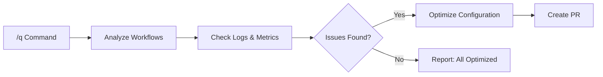

# 🔧 Q - Agentic Workflow Optimizer

> For an overview of all available workflows, see the [main README](../README.md).

**Expert system for optimizing and fixing agentic workflows**

The [Q workflow](../workflows/q.md?plain=1) analyzes workflow performance, identifies missing tools, detects inefficiencies, and creates pull requests with optimized configurations.

## Installation

```bash
# Install the 'gh aw' extension
gh extension install github/gh-aw

# Add the workflow to your repository
gh aw add-wizard githubnext/agentics/q
```

This walks you through adding the workflow to your repository.

## How It Works



The workflow downloads recent workflow logs and audit information, examines workflow files, researches best practices, and validates changes using the compile tool.

## Usage

This workflow triggers from issue or PR comments - you cannot start it manually.

### Usage as a General-Purpose Assistant

Trigger on any issue or PR:

```
/q
```

Example commands:

```
/q Analyze all workflows and suggest optimizations
/q Fix the missing tools in the repo-assist workflow
/q Investigate why the CI doctor workflow is failing
/q Extract common patterns from coding workflows into a shared config
/q Optimize workflows with high token usage
```

### Configuration

This workflow requires no configuration and works out of the box.

After editing run `gh aw compile` to update the workflow and commit all changes to the default branch.

### Triggering CI on Pull Requests

To automatically trigger CI checks on PRs created by this workflow, configure an additional repository secret `GH_AW_CI_TRIGGER_TOKEN`. See the [triggering CI documentation](https://github.github.com/gh-aw/reference/triggering-ci/) for setup instructions.

### Human in the Loop

- Review the analysis and findings before accepting optimizations
- Validate that suggested changes align with your requirements
- Test workflow changes before merging
