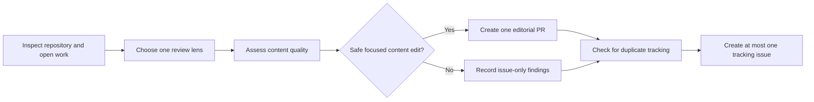

# 📰 Tech Content Editorial Board

> For an overview of all available workflows, see the [main README](../README.md).

**Daily editorial-board review of the repository's technical rigor, wording, structure, and editorial quality**

The [Tech Content Editorial Board workflow](../workflows/tech-content-editorial-board.md?plain=1) is a [GitHub Agentic Workflow](https://github.blog/ai-and-ml/automate-repository-tasks-with-github-agentic-workflows/) for reviewing a technical content repository as if it were being examined by a demanding editorial board of principal engineers, technical writers, and domain specialists. It focuses on content quality first: clarity, rigor, structure, examples, caveats, flow, and reader trust.

Rather than producing a passive report, the workflow is biased toward action. When it finds a safe, focused content improvement, it prefers to ship one small content pull request in the same run. It can also create a single tracking issue for materially new editorial backlog that is not already covered by an open issue or pull request.

## Installation

```bash
# Install the 'gh aw' extension
gh extension install github/gh-aw

# Add the workflow to your repository
gh aw add-wizard githubnext/agentics/tech-content-editorial-board
```

This walks you through adding the workflow to your repository.

## How It Works



Each run starts by inspecting the repository, recent work, and open issues or pull requests so it does not duplicate existing tracking. It then selects a review lens and evaluates the repository as a technical publishing asset, looking for weaknesses in:

- Technical rigor and accuracy
- Wording, clarity, and flow
- Structure and narrative coherence
- Examples, diagrams, and caveats
- Reader trust and practical usefulness

When a low-risk, article-level improvement is available, the workflow should prefer making that edit and opening a focused pull request. Any broader or remaining backlog is then summarized in at most one tracking issue.

## Simulated Board Personas

The workflow simulates a board-style review using named personas with distinct areas of expertise:

- **The Editor** — wording, structure, flow, coherence, section ordering, rewrites, and whether the article's argument lands clearly for engineering readers
- **The Critic** — devil's-advocate skepticism, anti-hype pressure testing, second-order effects, hidden assumptions, and missing downside
- **Martin Kleppmann** — consistency, correctness, ordering, edge cases
- **Martin Fowler** — architecture, patterns, trade-offs, diagrams
- **Robert C. Martin (Uncle Bob)** — clean architecture, separation of concerns
- **Katherine Rack** — systems thinking, scale, failure cascades
- **Ben Sigelman** — observability, tracing, debugging
- **Klaus Marquardt** — Kafka, partitioning, message keys
- **Greg Young** — DDD, event sourcing, CQRS
- **Tanya Janca** — security, resilience, secrets hygiene
- **Kelsey Hightower** — operations, deployment realism, maintainability
- **Charity Majors** — on-call pain, telemetry, failure clarity

In addition to those board voices, the workflow uses an **Orchestrator** role during synthesis. The Orchestrator does not act as another reviewer; it pulls together the strongest themes, conflicts, objections, and concrete next actions into maintainable recommendations for humans to review.

## Usage

This workflow runs daily on weekdays and can also be started manually.

```bash
gh aw run tech-content-editorial-board
```

### Configuration

The workflow is designed to work out of the box for technical documentation repositories. By default it:

- Runs on weekdays
- Focuses on content-only improvements rather than infrastructure or code changes
- Creates at most one pull request and one issue per run
- Uses repository memory to keep editorial attention moving across different focus areas over time

After editing run `gh aw compile` to update the workflow and commit all changes to the default branch.

### Human in the Loop

- Review the editorial pull request for tone, accuracy, and scope
- Confirm that suggested backlog items are worth tracking
- Merge only the focused content changes that match your publishing standards
- Adjust prompts or schedule if you want the board to be more aggressive or more selective
