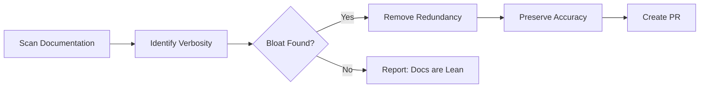

# 🗜️ Documentation Unbloat

> For an overview of all available workflows, see the [main README](../README.md).

**Review and simplify documentation by removing verbosity while maintaining clarity**

The [Documentation Unbloat workflow](../workflows/unbloat-docs.md?plain=1) runs daily to remove duplicate content, excessive bullet points, redundant examples, and verbose descriptions - while preserving all essential information, links, and technical details.

## Installation

```bash
# Install the 'gh aw' extension
gh extension install github/gh-aw

# Add the workflow to your repository
gh aw add-wizard githubnext/agentics/unbloat-docs
```

This walks you through adding the workflow to your repository.

## How It Works



The workflow improves exactly **one file per run** for easy review. Files with `disable-agentic-editing: true` in frontmatter are skipped. Uses cache memory to track previously cleaned files.

## Usage

### Commands

You can start a run immediately:

```bash
gh aw run unbloat-docs
```

### Usage as a General-Purpose Assistant

Trigger in a PR comment:

```
/unbloat
```

### Configuration

The workflow runs daily. You can customize directories to scan, success criteria, and exclusion patterns.

After editing run `gh aw compile` to update the workflow and commit all changes to the default branch.

### Triggering CI on Pull Requests

To automatically trigger CI checks on PRs created by this workflow, configure an additional repository secret `GH_AW_CI_TRIGGER_TOKEN`. See the [triggering CI documentation](https://github.github.com/gh-aw/reference/triggering-ci/) for setup instructions.

## Learn More

- [Daily Documentation Updater](daily-doc-updater.md) - Ensures accuracy and completeness
- [Glossary Maintainer](glossary-maintainer.md) - Keeps terminology consistent
- [Link Checker](link-checker.md) - Validates all documentation links
