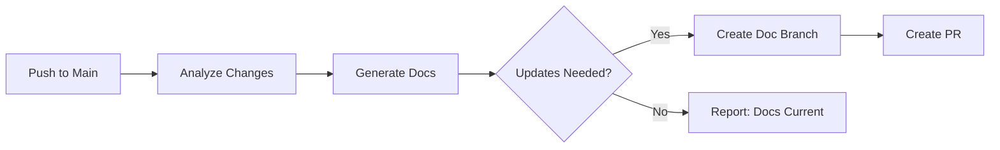

# 📖 Regular Documentation Update

> For an overview of all available workflows, see the [main README](../README.md).

**Automatically update documentation on each push to main**

The [Update Documentation workflow](../workflows/update-docs.md?plain=1) runs on each push to main to analyze changes and create pull requests with documentation updates. It defaults to using Astro Starlight for documentation generation.

## Installation

```bash
# Install the 'gh aw' extension
gh extension install github/gh-aw

# Add the workflow to your repository
gh aw add-wizard githubnext/agentics/update-docs
```

This walks you through adding the workflow to your repository.

## How It Works



The workflow may search for best practices, examples, or technical references online to improve documentation.

## Usage

### Configuration

This workflow requires no configuration and works out of the box. You can customize documentation frameworks, structure, themes, and directories.

After editing run `gh aw compile` to update the workflow and commit all changes to the default branch.

### Commands

You can start a run immediately:

```bash
gh aw run update-docs
```

### Triggering CI on Pull Requests

To automatically trigger CI checks on PRs created by this workflow, configure an additional repository secret `GH_AW_CI_TRIGGER_TOKEN`. See the [triggering CI documentation](https://github.github.com/gh-aw/reference/triggering-ci/) for setup instructions.

### Human in the Loop

- Review documentation update PRs for accuracy and clarity
- Validate documentation changes reflect actual code behavior
- Test documentation examples and instructions
