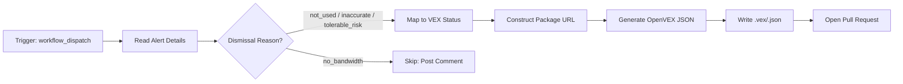

# 🔒 VEX Generator

> For an overview of all available workflows, see the [main README](../README.md).

**Auto-generate OpenVEX statements for dismissed Dependabot alerts**

The [VEX Generator workflow](../workflows/vex-generator.md?plain=1) captures Dependabot alert dismissal decisions as machine-readable [OpenVEX v0.2.0](https://openvex.dev/) statements, making them consumable by downstream vulnerability scanners and SBOM tools.

## Installation

```bash
# Install the 'gh aw' extension
gh extension install github/gh-aw

# Add the workflow to your repository
gh aw add-wizard githubnext/agentics/vex-generator
```

This walks you through adding the workflow to your repository.

## How It Works



## Usage

### Triggering the Workflow

Run the workflow manually via the GitHub Actions UI or CLI, providing the dismissed alert's details as inputs:

```bash
gh workflow run vex-generator \
  --field alert_number=42 \
  --field ghsa_id=GHSA-xvch-5gv4-984h \
  --field cve_id=CVE-2021-44906 \
  --field package_name=minimist \
  --field package_ecosystem=npm \
  --field severity=high \
  --field summary="Prototype pollution in minimist" \
  --field dismissed_reason=not_used
```

### Inputs

| Input | Description | Required |
|---|---|---|
| `alert_number` | Dependabot alert number | Yes |
| `ghsa_id` | GHSA ID (e.g., `GHSA-xvch-5gv4-984h`) | Yes |
| `cve_id` | CVE ID (e.g., `CVE-2021-44906`) | Yes |
| `package_name` | Affected package name | Yes |
| `package_ecosystem` | Ecosystem: `npm`, `pip`, `maven`, `gem`, `golang`, `nuget` | Yes |
| `severity` | Severity: `low`, `medium`, `high`, `critical` | Yes |
| `summary` | Brief vulnerability summary | Yes |
| `dismissed_reason` | One of: `not_used`, `inaccurate`, `tolerable_risk`, `no_bandwidth` | Yes |

### Dismissal Reason Mapping

The workflow maps Dependabot dismissal reasons to OpenVEX statuses:

| Dismissal Reason | VEX Status | VEX Justification |
|---|---|---|
| `not_used` | `not_affected` | `vulnerable_code_not_present` |
| `inaccurate` | `not_affected` | `vulnerable_code_not_in_execute_path` |
| `tolerable_risk` | `not_affected` | `inline_mitigations_already_exist` |
| `no_bandwidth` | _(skipped)_ | This dismissal does not represent a security assessment |

### Output

For each eligible dismissal, the workflow creates a pull request adding a `.vex/<ghsa-id>.json` file — a valid OpenVEX v0.2.0 document:

```json
{
  "@context": "https://openvex.dev/ns/v0.2.0",
  "@id": "https://github.com/owner/repo/vex/GHSA-xvch-5gv4-984h",
  "author": "GitHub Agentic Workflow <vex-generator@github.com>",
  "role": "automated-tool",
  "timestamp": "2024-01-15T12:00:00Z",
  "version": 1,
  "tooling": "GitHub Agentic Workflows (gh-aw) VEX Generator",
  "statements": [
    {
      "vulnerability": {
        "@id": "GHSA-xvch-5gv4-984h",
        "name": "CVE-2021-44906",
        "description": "Prototype pollution in minimist"
      },
      "products": [
        {
          "@id": "pkg:npm/my-package@1.2.3"
        }
      ],
      "status": "not_affected",
      "justification": "vulnerable_code_not_present",
      "impact_statement": "The minimist package is listed as a dev dependency only and is not included in production builds."
    }
  ]
}
```

### Human in the Loop

- Review the generated VEX statement PR before merging
- Verify the `impact_statement` accurately reflects your project's situation
- The `.vex/README.md` created alongside the statements explains the directory to future contributors

## Learn More

- [OpenVEX Specification](https://openvex.dev/)
- [GitHub Dependabot Alerts Documentation](https://docs.github.com/en/code-security/dependabot/dependabot-alerts/about-dependabot-alerts)
- [Package URL (purl) Specification](https://github.com/package-url/purl-spec)
