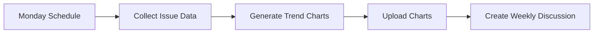

# 📊 Weekly Issue Summary

> For an overview of all available workflows, see the [main README](../README.md).

**Generate comprehensive weekly reports on issue activity with trend charts and recommendations**

The [Weekly Issue Summary workflow](../workflows/weekly-issue-summary.md?plain=1) runs every Monday at 3 PM UTC to collect issue data, generate trend charts, and create a detailed discussion with statistics and actionable recommendations.

## Installation

```bash
# Install the 'gh aw' extension
gh extension install github/gh-aw

# Add the workflow to your repository
gh aw add-wizard githubnext/agentics/weekly-issue-summary
```

This walks you through adding the workflow to your repository.

## How It Works



The workflow produces two charts:
- **Issue Activity Trends**: Weekly opened vs. closed counts and running open total
- **Resolution Time Trends**: Average and median days-to-close over time

Older `[Weekly Summary]` discussions are automatically closed when new ones are created.

## Usage

### Configuration

The workflow runs every Monday at 3 PM UTC. To change the schedule, edit the `cron` expression in the workflow frontmatter.

Requires:
- GitHub Discussions category named `audits`
- Python 3 on the Actions runner
- Network access for Python packages (`pandas`, `matplotlib`, `seaborn`)

After editing run `gh aw compile` to update the workflow and commit all changes to the default branch.
