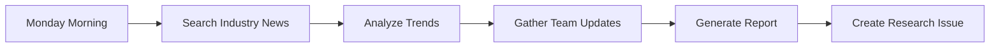

# 📚 Weekly Research

> For an overview of all available workflows, see the [main README](../README.md).

**Collect research updates and post them to a new issue each Monday morning**

The [Weekly Research workflow](../workflows/weekly-research.md?plain=1) runs each Monday to search industry news, analyze trends, gather team updates, and generate a comprehensive research report issue.

## Installation

```bash
# Install the 'gh aw' extension
gh extension install github/gh-aw

# Add the workflow to your repository
gh aw add-wizard githubnext/agentics/weekly-research
```

This walks you through adding the workflow to your repository.

## How It Works



The workflow searches for latest trends from software industry sources, related products, research papers, and market opportunities.

## Usage

### Configuration

This workflow requires no configuration and works out of the box. You can customize output format, research topics, report length, and frequency.

After editing run `gh aw compile` to update the workflow and commit all changes to the default branch.

### Human in the Loop

- Review the research report for accuracy
- Add additional context via comments
- Close the issue once insights have been reviewed

### Security

- The agentic step runs with read-only GitHub permissions
- No access to secrets
- Does not modify existing issues
- Uses "safe outputs" to create the research report issue
